# Active-Directory-Lab-using-Oracle-VirtualBox

In this lab, I set up an Active Directory environment using Oracle VirtualBox, including a domain controller and virtual network. PowerShell scripts were used to automate user creation and management. This project was focused around learning AD configuration, automation, and system administration.

# Overview

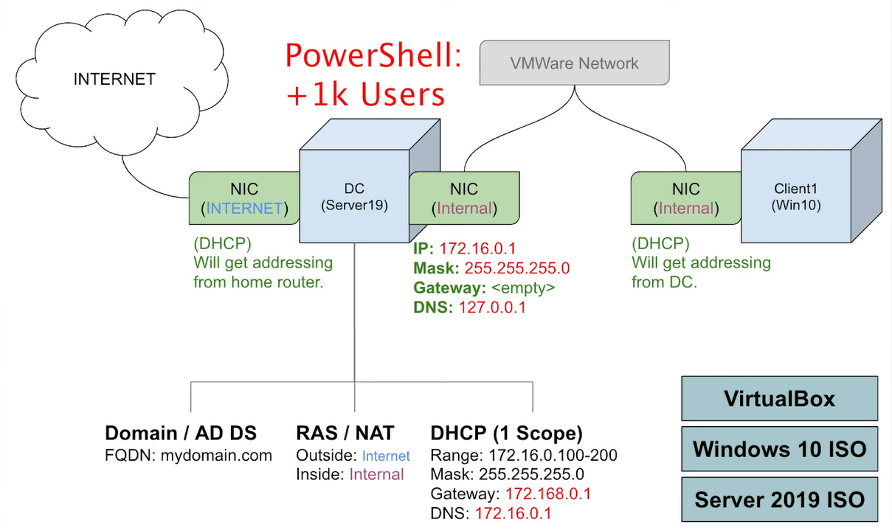

# Requirements
- **Software**:
  - VirtualBox (for virtualization)
  - Windows 10 ISO (for client machine)
  - Windows Server 2019 ISO (for domain controller)
  
- **Network Configuration**:
  - Two Network Interface Cards (NICs) per machine
    - **NIC 1**: Connected to the Internet (DHCP enabled)
    - **NIC 2**: Internal network (static IP configuration)

# Environment Setup

## 1. VirtualBox Setup
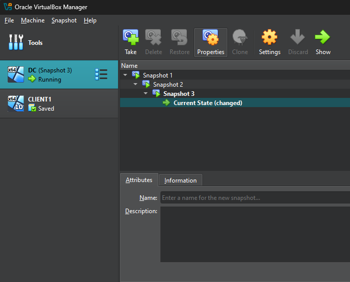
- Create two virtual machines (VMs) in VirtualBox:
  - One VM is configured as **Server 2019** for the domain controller (DC).
  - One VM is configured as **Windows 10** for the client machine.

## 2. Networking Configuration
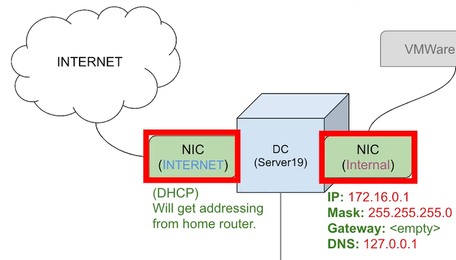
- **NIC 1** (for internet connection):
  - Set to obtain an IP address automatically via DHCP from the home router.
- **NIC 2** (for internal network):
  - Static IP configuration:
    - **IP Address**: `172.16.0.1`
    - **Subnet Mask**: `255.255.255.0`
    - **Default Gateway**: Leave blank
    - **DNS**: `127.0.0.1`
  
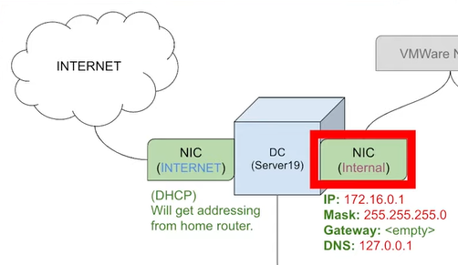
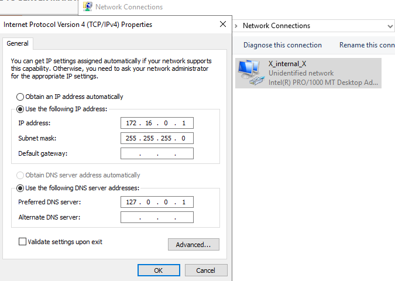

## 3. Domain Controller Configuration
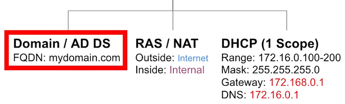
- Install **Active Directory Domain Services (AD DS)** on Server 2019.
- Configure the domain with the Fully Qualified Domain Name (FQDN): `mydomain.com`.

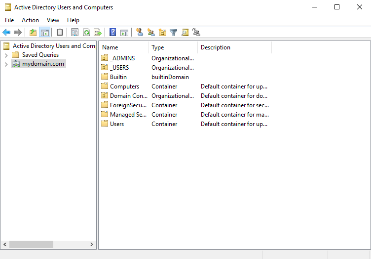

## 4. RAS/NAT (Routing)
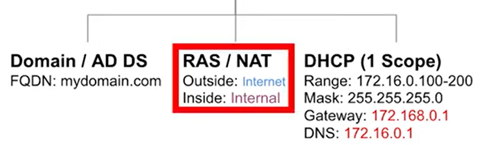
- Install the **Remote Access Service (RAS)** role on the domain controller to enable NAT.
- Configure NAT to allow internet access for devices on the internal network:
  1. Open the **Routing and Remote Access** console.
  2. Configure NAT for **NIC 1** (external interface connected to the internet).
  3. Verify that the internal network (connected via **NIC 2**) can access the internet through the NAT configuration.

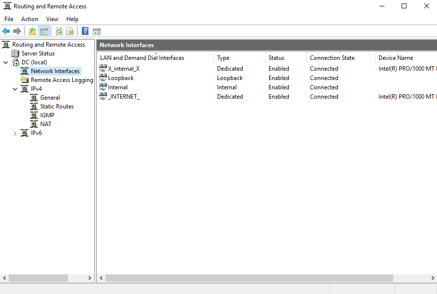

## 5. DHCP
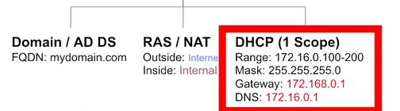
- Installed and configured the **DHCP Server** role on the domain controller.
- Set up a DHCP scope to assign IP addresses dynamically to devices on the internal network:
  - **IP Range**: `172.16.0.100 - 172.16.0.200`
  - **Subnet Mask**: `255.255.255.0`
  - **Default Gateway**: `172.16.0.1`
  - **DNS Server**: `172.16.0.1`
- Verified that the Windows 10 client successfully received an IP address and could communicate with the domain controller and access the internet via NAT.
  
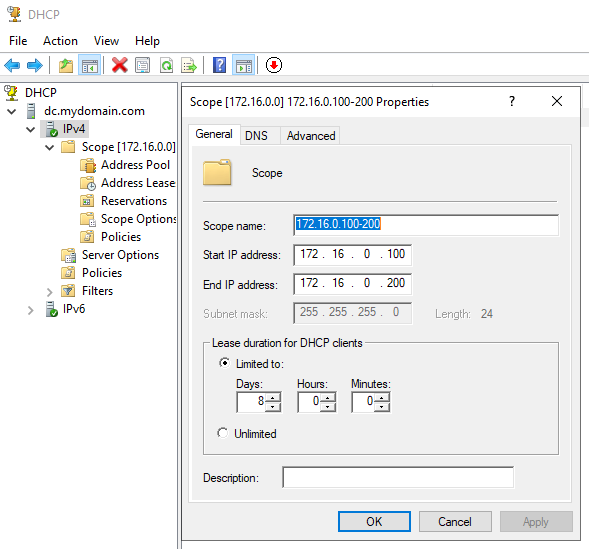

## 6. Add 1000 users via. Powershell script
The script utilizes a txt file of first and last names in alphabetical order. The txt file is stored in the same directory as the script.

### Powershell script
Below is the PowerShell script used to create users:

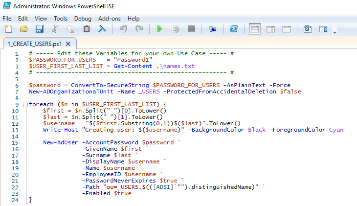

### Explanation of the Script
**Input**: The script reads names.txt to fetch names and creates corresponding users.

**Organizational Unit**: A new Organizational Unit (OU) named _USERS is created to store the accounts.

**Generated Usernames**: Usernames are generated by combining the first letter of the first name and the full last name (e.g., John Doe → jdoe).

**Password Policy**: All users are assigned a default password, Password1, which does not expire.

### Output
Below we can see all of the users in "_USERS" within Active Directory Users and Computers:
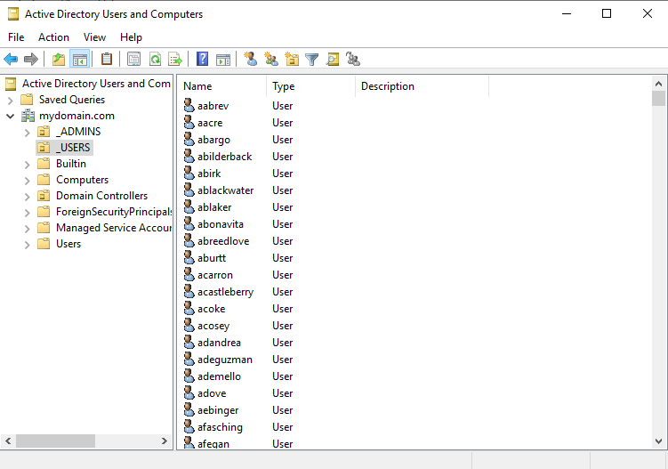

## 6. Creating Client & Interacting with the Domain Controller
- **Install Windows 10 on the Client VM**: Install Windows 10 on the Client VM: After creating the Client VM in Oracle VirtualBox, I installed the Windows 10 ISO to set up the operating system.

- **Configure Networking**: To enable the Client VM to communicate with the Domain Controller and obtain an IP address from the DHCP server, I configured the network adapter of the Client VM to use the Internal Network.

- **Test Network Configuration**: After starting the Client VM and logging in, I verified the network settings using the ipconfig command in the terminal. The screenshot below shows the network configuration, confirming that the Client VM received an IP address (172.16.0.100) from the DHCP server.

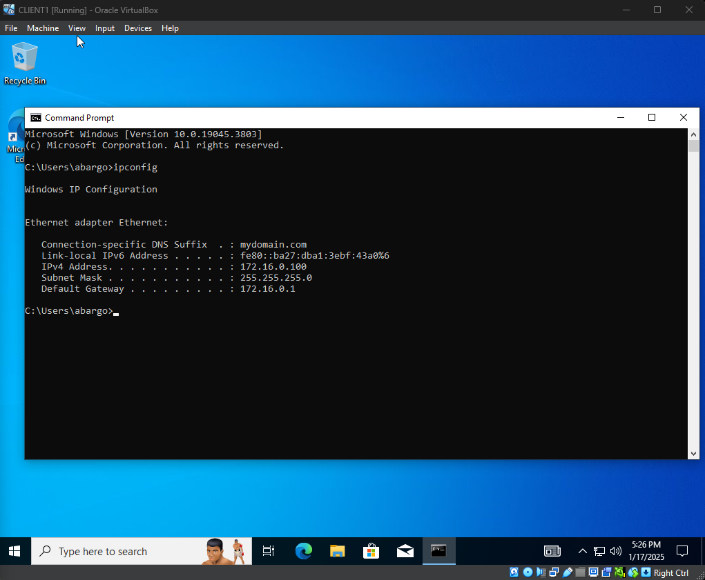

# Outcomes
- Through this lab, I gained practical experience with Active Directory, including setting up and configuring a Domain Controller to manage network resources effectively.

- I successfully created and implemented 1,000 users in Active Directory using a PowerShell script, which enhanced my understanding of user management and automation within a domain environment.

- I learned how to configure a Domain Controller, enabling it to serve as the central authentication and authorization point in a networked environment.

- I configured and tested a DHCP server, ensuring client machines could receive IP addresses dynamically.
